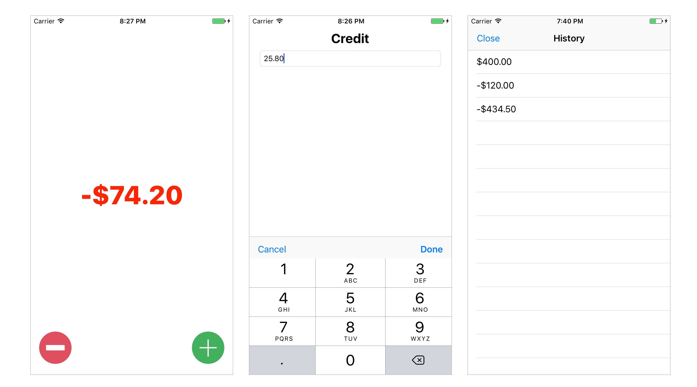

# MyWallet
This is an iOS app with 100% test coverage! The goal is not to discuss how much we should cover, but to show how we test different scenarios. With few exceptions, the tests are based on Sandi Metz's great talk: [The Magic Tricks of Testing](https://www.youtube.com/watch?v=URSWYvyc42M)

# UI

## Incoming Query: Assert Result
[testEqualsDoesConsiderBalanceStatus](https://github.com/danielCarlosCE/MyWallet/blob/master/MyWalletTests/WalletViewModelTests.swift#L20)

### Incoming Command: Assert direct public side effects
[testLoadViewDoesSetOutlets](https://github.com/danielCarlosCE/MyWallet/blob/master/MyWalletTests/ViewController2Tests.swift#L14)

### Outgoing Command: Expect to send
[testAddExpenseWithPositiveValueDoesAddNegativeValue](https://github.com/danielCarlosCE/MyWallet/blob/master/MyWalletTests/ViewModelTests.swift#L31)

### Dependency Injection
[ViewModel(storage: testStorage)](https://github.com/danielCarlosCE/MyWallet/blob/master/MyWalletTests/ViewModelTests.swift#L11)

### Mock/Stub
[TestDelegate](https://github.com/danielCarlosCE/MyWallet/blob/master/MyWalletTests/ViewModelTests.swift#L75)
